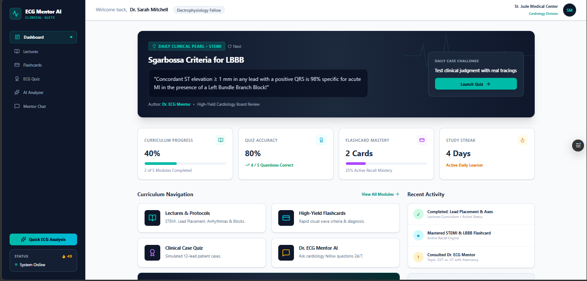
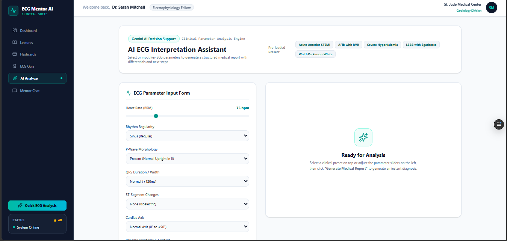
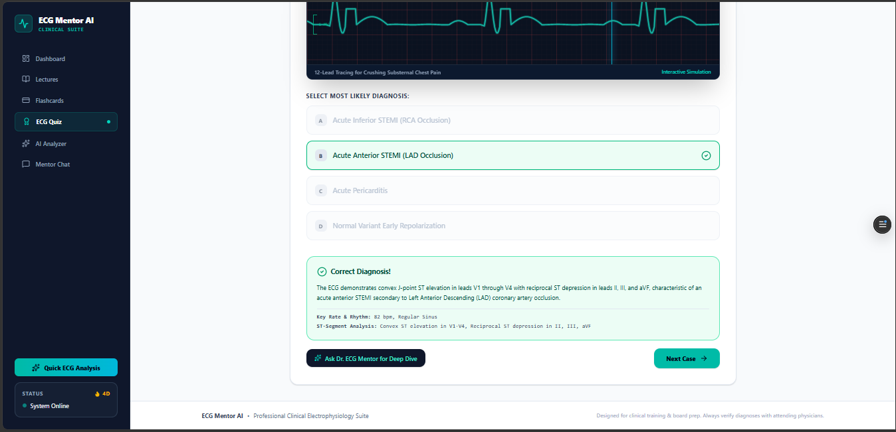

# 🩺 ECG Mentor AI

ECG Mentor AI is an AI-powered educational web application that helps students, beginners, and healthcare learners understand ECG (Electrocardiogram) reports more easily. Instead of struggling with complex ECG terminology, users can upload an ECG image or ask ECG-related questions and receive clear, easy-to-understand explanations generated by AI.

The app solves the real-life problem of making ECG interpretation simpler and more accessible for medical students, healthcare trainees, and anyone learning about heart rhythms.

---

# 🌐 Live Application

🔗 **Live Demo:** https://ecg-mentor-ai.vercel.app/

---

# ✨ Features

- 📷 Upload an ECG image for AI analysis.
- 🤖 AI explains ECG findings in simple language.
- ❤️ Identifies possible heart rhythm abnormalities.
- 📚 Provides educational explanations for ECG concepts.
- ❓ Ask ECG-related questions through an AI chat interface.
- 🎓 Beginner-friendly responses for learning purposes.
- ⚡ Fast and responsive web interface.
- 📱 Works on desktop and mobile devices.

---

# 🧠 AI Feature

The core feature of ECG Mentor AI is its AI-powered ECG interpretation assistant.

The AI analyzes uploaded ECG images or answers user questions about ECGs by providing educational explanations instead of replacing professional medical diagnosis.

## AI Instructions / System Prompt

The AI was instructed to behave as an educational ECG mentor. Its instructions include:

- Explain ECGs in simple and beginner-friendly language.
- Analyze uploaded ECG images and describe important visible patterns.
- Identify possible rhythm abnormalities when detectable.
- Explain medical terminology clearly.
- Answer ECG-related questions accurately.
- Encourage users to seek professional medical advice for diagnosis.
- Never claim certainty when the ECG cannot be interpreted confidently.
- Focus on education rather than replacing healthcare professionals.

---

# 🛠️ Tools, Services & AI Models Used

## Frontend
- React
- Next.js
- Tailwind CSS

## Deployment
- Vercel

## AI
- Google AI Studio
- Gemini AI Model

## Development Tools
- Visual Studio Code
- Git
- GitHub

---

# 📸 Screenshots

> Add your screenshots inside a folder named **screenshots** in your repository.

### Home Page



---

### ECG Analysis



---

### AI Response



---

# 🚀 How to Run the Project

## 1. Clone the Repository

```bash
git clone https://github.com/yourusername/ecg-mentor-ai.git
```

## 2. Navigate to the Project Folder

```bash
cd ecg-mentor-ai
```

## 3. Install Dependencies

```bash
npm install
```

## 4. Configure Environment Variables

Create a `.env.local` file and add your API key.

```env
GOOGLE_API_KEY=your_api_key_here
```

> Never commit API keys or secrets to GitHub.

## 5. Run the Development Server

```bash
npm run dev
```

Open:

```
http://localhost:3000
```

---

# 📂 Project Structure

```
ecg-mentor-ai/
│
├── app/
├── components/
├── public/
├── screenshots/
├── styles/
├── .env.local
├── package.json
└── README.md
```

---

# 🎯 Target Users

- Medical students
- Nursing students
- Healthcare trainees
- ECG beginners
- Anyone interested in learning ECG interpretation

---

# ⚠️ Disclaimer

ECG Mentor AI is designed for educational and learning purposes only.

It is **not** intended to replace professional medical advice, diagnosis, or treatment. Users should always consult qualified healthcare professionals for medical decisions.

---

# 👨‍💻 Author

Developed as the final AI application project for the AI course.

---

# 📄 License

This project is intended for educational purposes.
